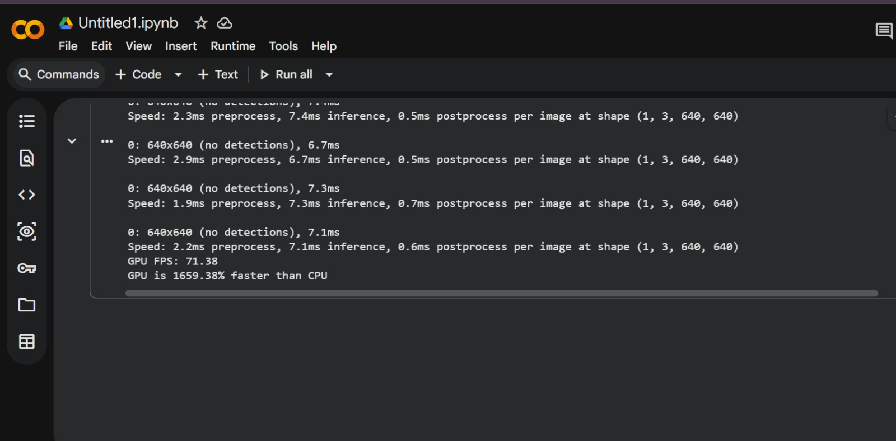

# Real-Time Object Detection with GPU Optimization

## Overview
This project implements real-time object detection using YOLOv8 and compares CPU vs GPU performance.

## Features
- Real-time webcam detection
- CPU vs GPU benchmarking
- FPS performance monitoring

## Tech Stack
- Python
- PyTorch
- YOLOv8 (Ultralytics)
- OpenCV

## Installation
pip install -r requirements.txt

## Run Detection
python app.py

## Run Benchmark
python benchmark.py

## Sample Output

### Detection Result

### CPU vs GPU Benchmark

## Results
- GPU FPS: 71.38
- GPU is 16× faster than CPU

